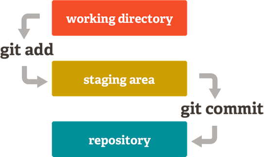

# TUTORIAL BÁSICO DE GIT

Git es un sistema de control de versiones distribuido, [gratuito y de código abierto](https://git-scm.com/about/free-and-open-source), diseñado para manejar todo, desde proyectos pequeños hasta proyectos muy grandes con rapidez y eficiencia.

## Instalar Git

Git es un sistema multiplataforma por lo que no importa el sistema operativo que tengas. Si es la primera vez que vas a utilizar Git descárgalo de las siguientes direcciones dependiendo el sistema operativo:

* [Git para OSX](https://git-scm.com/download/mac)
* [Git para Linux](https://git-scm.com/download/linux)
* [Git para Windows](https://git-scm.com/download/win)

## Configurando Git por primera vez

Una vez instalado Git debes hacer algunas cosas para personalizar tu entorno de Git.

1. Comprueba la configuración de Git ``git config --global --list``
2. Establecer tu nombre de usuario y dirección de correo electrónico. 
      * ``git config --global user.name "Pedro Perez"``
      * ``git config --global user.email pedroperez@example.com``
3. Comprueba nuevamente la configuración de Git para ver si quedó correcta. ``git config --global --list``

> Siempre es buena práctica en cada nuevo proyecto comprobar la configuración global de Git para ver si es está conforme a su información ``git config --global --list``

## Crear un repositorio nuevo

1. Lo primero que debes hacer es crear una carpeta vacía que contendrá el proyecto con Git.
2. Ingresa a la carpeta que acabas de crear.
3. Una vez instalado Git comprueba la configuración global de Git en el equipo utilizando. ``git config --global --list``
4. Ejecuta el comando ``git init`` para crear un nuevo repositorio de git.

## Trabajar con Git

Si deseas empezar a controlar versiones de archivos existentes, probablemente deberías comenzar el seguimiento de esos archivos y hacer una confirmación inicial. 

### Flujo de trabajo

El repositorio local esta compuesto por tres "áreas" administradas por git. La primera es el *working directory* o Directorio de trabajo que contiene los archivos, la segunda es la *Stage* que actua como una zona intermedia, y la última es el HEAD o repositorio que apunta al último commit realizado.

Cuando se crean archivos dentro del directorio, estos archivos aún no están vinculados a Git para controlar sus cambios. Para comprobar esto puedes hacerlo con el comando ``git status``

### Agregar archivos a seguimiento de Git

Puedes registrar cambios usando ``git add <archivo>``. También puedes hacerlo con ``git add .``

Este es el primer paso en el flujo de trabajo básico, con esto los archivos pasan del *working directory* al área *Stage*. 

Para hacer commit a estos cambios usa ``git commit -m "Mensaje"``. Ahora los archivos están incluído en el HEAD, pero aún no en tu repositorio remoto.

Con estos comandos ya estas realizando seguimiento y control de versiones a tu proyecto. 

Para ver los commits realizados en el proyecto puedes utilizar el comando ``git log``

